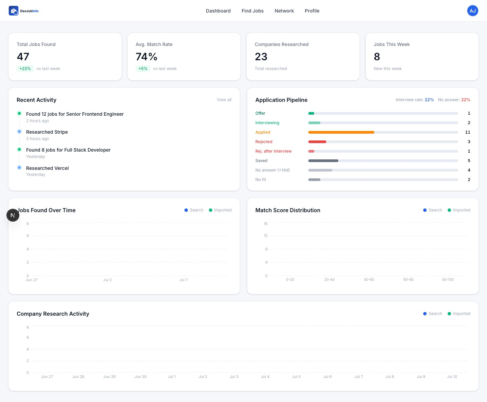
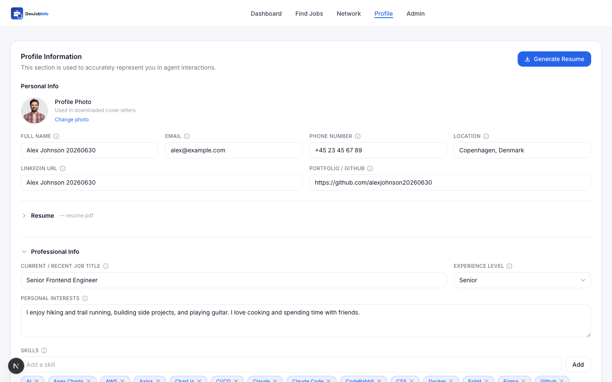
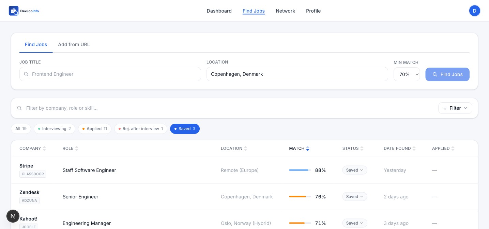
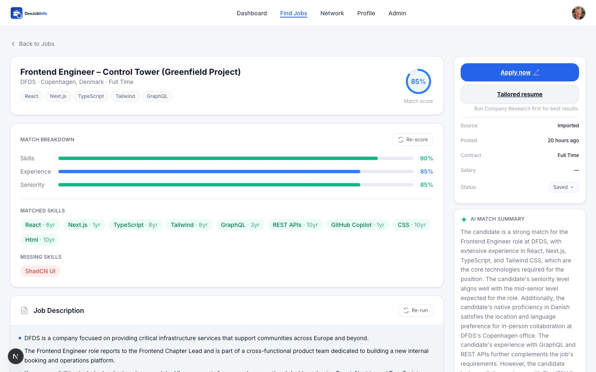
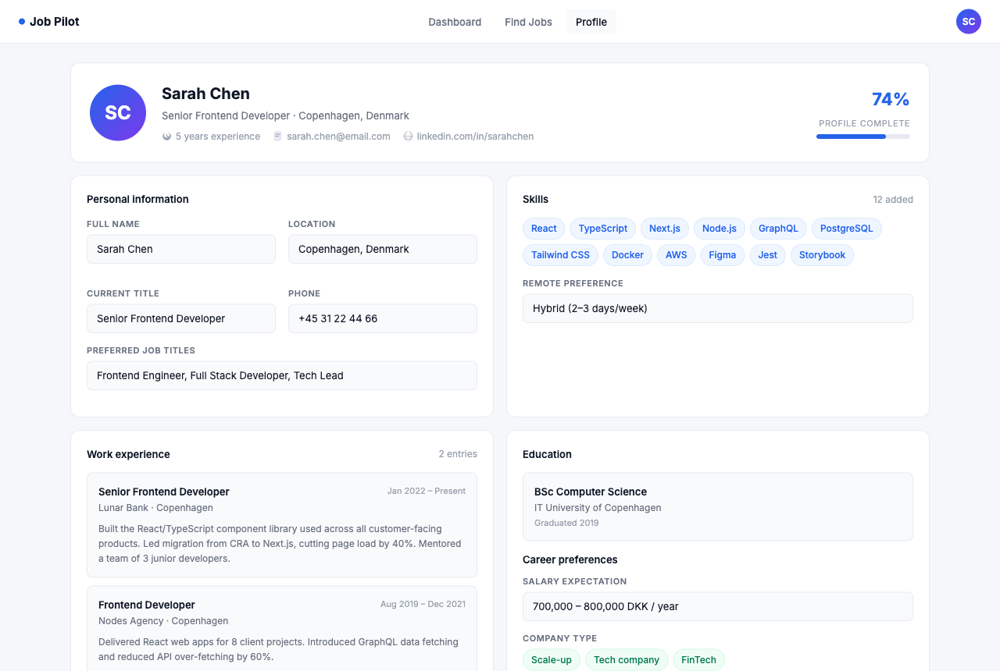
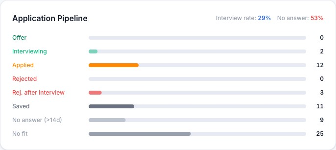
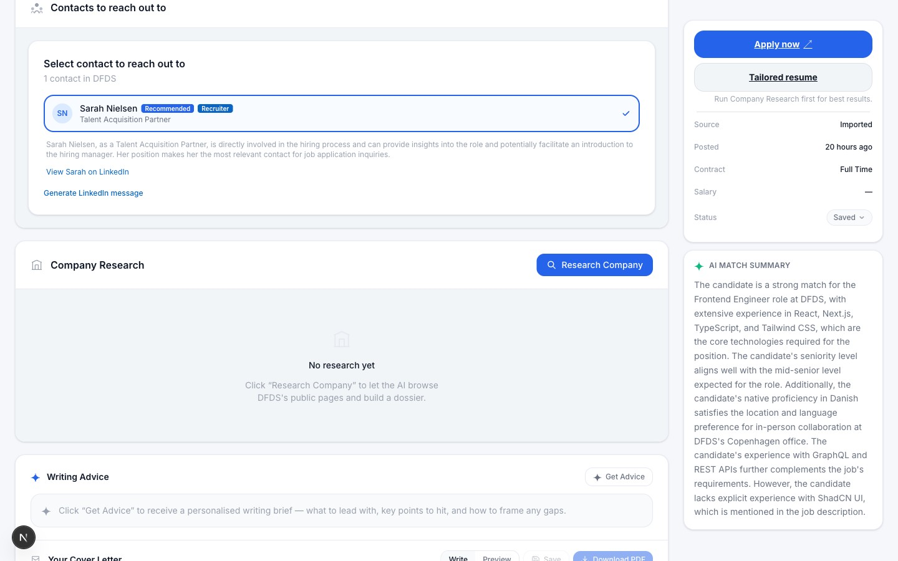
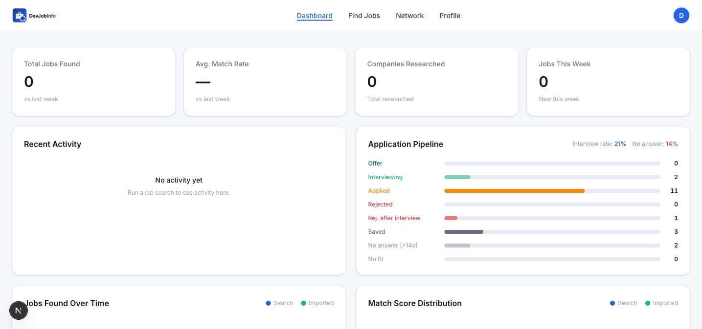
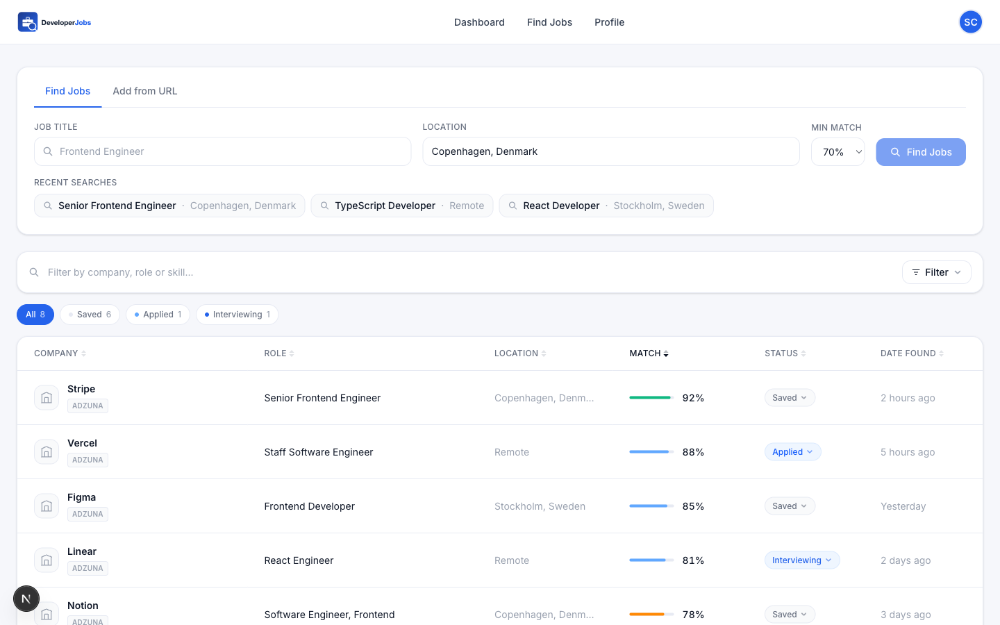
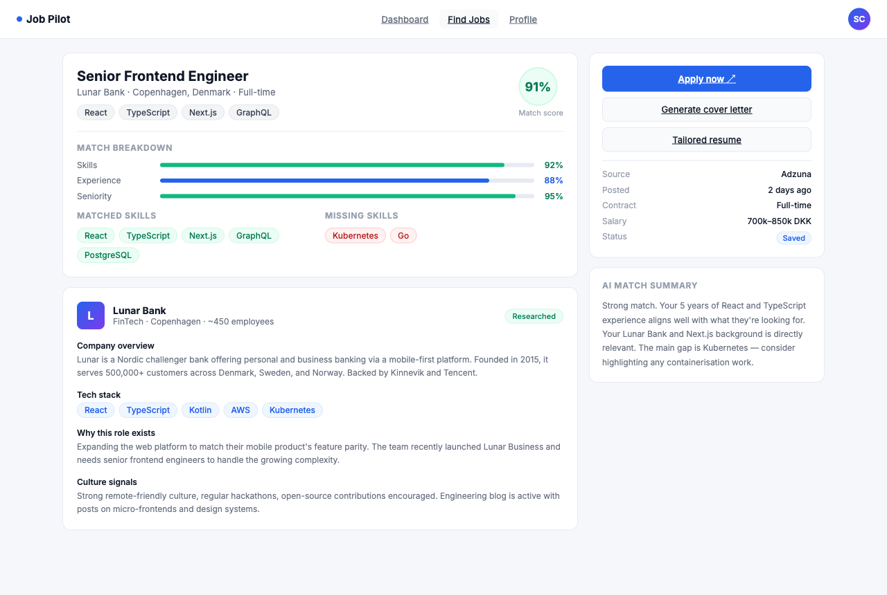

# DevJobInfo

An AI-powered job hunting assistant. Set up your profile once, then let the agent find relevant jobs, score them against your actual skills, research each company, generate a tailored cover letter and resume, and tell you who in your network to reach out to — all before you click Apply.

**Live:** [devjob.info](https://devjob.info)

---



---



---

## How it works

Three steps. No manual searching.

| Step | What happens |
|---|---|
| **1. Build your profile** | Enter your work history, skills, and cover letter style rules once. Upload a PDF resume — AI pre-fills everything automatically. |
| **2. Search & score** | Type a job title and location. The agent queries five job boards in parallel and AI scores every result 0–100 against your actual skills. |
| **3. Apply with confidence** | Research the company, generate a tailored cover letter and resume, write a motivation paragraph, find a warm intro in your LinkedIn network — all from one page. |

### Dashboard stats

The dashboard shows four stat cards with week-over-week and month-over-month comparisons:

| Card | Source | Comparison |
|---|---|---|
| **Jobs found this month** | PostHog `job_found` events | vs previous calendar month |
| **Avg. Match Rate** | PostHog `job_found` events (matchScore property) | vs previous 7-day window |
| **Applied this week** | `jobs` table (`status = applied`, `updated_at`) | vs previous calendar week (Mon–Sun) |
| **Jobs this week** | PostHog `job_found` events | vs previous calendar week |

Each card shows the percentage change and the raw prior-period number.

---

## Features

### Job discovery and AI scoring

Search Adzuna, JobTech, Jooble, CareerJet, and Glassdoor simultaneously. GPT-4o reads every posting against your profile and assigns a match score 0–100, with a breakdown of exactly which skills match and which are missing — so you spend time only on roles worth applying to.



You can also paste any job URL directly to import a posting that didn't appear in search results.

#### Postings keep their own language

Job descriptions are never translated. A Danish posting stays Danish end to end —
the stored description, the bullet-point summary shown on the job detail page, and
the generated cover letter.

`lib/detect-language.ts` identifies the language from high-frequency marker words
(Danish, Swedish, Norwegian, German, Dutch, French, Spanish, English), and every
generator is told to write in that language. Technical terms, tool names and job
titles are kept verbatim regardless of language.

Summaries used to come out in English for non-English postings, because
`summarizeDescription` existed as three near-identical copies whose prompts were
all English-only. It now lives once in `lib/summarize-description.ts`.

Jobs summarised before this fix still hold their English summary. **Regenerate
summaries** re-runs them in the original language.

---

### Company research

Click **Research Company** and the agent fetches the company's public website over HTTP, reads the homepage, About, and Engineering/Blog pages, then produces a structured dossier:

- Business overview and product
- Tech stack and engineering culture signals
- Why this role exists
- Smart interview prep talking points

Also searches DuckDuckGo for the original job posting to extract contact names, emails, and phone numbers. Falls back to GPT-4o synthesis from the job description if the site can't be reached.



---

### AI cover letter — with humanise workflow

One click generates a personalised cover letter using Claude, your profile, the full job description, and the company research dossier. Letters are always written in the **detected language of the job posting** (Danish, Swedish, Norwegian, German, Dutch, French, Spanish, English).

**Getting a more human-sounding letter:**

1. Generate the letter and click **Copy & open Gemini**
2. Paste the letter into [gemini.google.com](https://gemini.google.com) and ask for style suggestions
3. Paste the suggestions back into the **Writing advice** field
4. Click **Recreate with advice** — the letter is rewritten using your advice as extra instructions

Download as PDF (compact or detailed layout, with optional photo, job title, and resume appendix) or copy as plain text.

---

### Tailored resume

Generate a job-specific resume PDF in one click from any job detail page. Claude optimises the resume for the target role, pulling from your full profile and up to three of your best past cover letter examples as a style reference.

You can also generate a **motivation paragraph** for your resume directly from the job page — a short first-person paragraph describing what you bring to this specific role.

Upload an existing PDF on the Profile page to pre-fill your entire profile automatically using AI extraction.

---

### Profile and resume builder



Build a structured profile with:
- Work experience (with reference contacts per role)
- Education, skills, and languages
- Cover letter style rules (Markdown — the AI follows them on every generation)
- Cover letter examples (unlimited; the AI uses the latest three as style references)
- LinkedIn recommendations
- Free-text resume input as an alternative to the structured form

---

### Application pipeline

Move jobs through **Saved → Applied → Interviewing → Offer → No answer → Rejected after interview**. When a job is marked Applied, the cover letter is automatically archived as a style example for future generations.

Every status change is tracked as a `job_status_changed` PostHog event so application velocity can be analysed over time.



---

### Network intelligence

Import your LinkedIn connections CSV once. DevJobInfo cross-references every connection against your job list so you always know when a warm intro is possible.



For each job, the AI:
- Lists all connections who work at that company
- Selects the single best contact to reach out to (recruiter, hiring manager, or relevant colleague) and explains why
- Generates a personalised, under-300-character LinkedIn outreach message

---

### Dashboard and activity log



The dashboard shows application pipeline status, jobs added over time, match score distribution, company research activity, and a live activity feed. PostHog powers the analytics charts.

An **AI token usage chart** is also displayed on the dashboard — a 14-day stacked area chart breaking down Claude token consumption by feature (cover letter, resume, motivation, company research, etc.), so you can track how much AI capacity you are using.

The agent log records every AI action — job scoring runs, research sessions, cover letter generations — so you can trace what happened and when.

---

### Credit system and payments

Access to the app requires purchasing credits via Stripe. After sign-up approval, users are redirected to a payment page where they can buy a credit package. The app is fully gated behind the credit check — unapproved or unpaid users cannot access any protected route.

- Payments are handled via **Stripe Checkout** (test and live modes supported)
- A Stripe webhook updates the user's credit balance in the database on successful payment
- Credit balance and payment history are visible in the user's account settings

#### How the gate works

`proxy.ts` checks two cookies on every protected route: `jp_approved` and
`jp_has_credit`. Missing credit redirects to `/payment`, which is itself exempt
so the redirect cannot loop.

Two rules that are easy to break:

1. **`PROTECTED_PATHS` and `config.matcher` must list the same routes.** A path in
   `PROTECTED_PATHS` but missing from `matcher` is not protected at all — the proxy
   never runs on it, so no session refresh happens and no auth header is forwarded.
   `/payment` was in one and not the other, and the page broke as a result.
2. **Cookies cannot be set from a Server Component.** Next allows cookie writes only
   in a Server Action or Route Handler. `/payment` used to stamp `jp_has_credit`
   during render, which threw at runtime and blanked the page for anyone with a
   balance. `PaymentClient` now calls `POST /api/payment/activate` instead.

`jp_has_credit` expires after 7 days and only the payment page re-stamps it, so a
returning user is briefly redirected through `/payment` before continuing.

Every early `return` in `proxy.ts` must carry the refreshed cookies via
`withRefreshedCookies()`. InsForge rotates refresh tokens, so a redirect that drops
them consumes a token and discards its replacement — which logs the user out.

---

### Onboarding

New users are walked through profile setup, job search, and company research step by step before reaching the full app.




---

## Feature summary

| Feature | Details |
|---|---|
| Job discovery | Adzuna, JobTech, Jooble, CareerJet, Glassdoor searched in parallel |
| Job import | Paste any URL — AI extracts the posting |
| AI scoring | Scores 0–100 with matched + missing skills per job |
| Company research | HTTP fetch + DuckDuckGo + GPT-4o → structured dossier with interview prep |
| Cover letter | Claude, language-detected, humanise workflow, PDF + plain text |
| Resume motivation | Claude generates a first-person motivation paragraph tailored to the role |
| Tailored resume | Claude generates a job-specific PDF per role |
| Resume extraction | Upload existing PDF — AI pre-fills your profile |
| Cover letter examples | Unlimited; newest three used as style reference on every generation |
| Cover letter rules | Markdown rules file — sole AI system prompt when set |
| LinkedIn recommendations | Store and display recommendations on your profile |
| Network intelligence | LinkedIn connection import, AI contact selection, message generation |
| Application tracking | Saved → Applied → Interviewing → Offer pipeline with more statuses |
| Dashboard analytics | Activity, scores, research, and AI token usage charts via PostHog |
| Credit system | Stripe-powered one-time credit purchase; access gated until credits purchased |
| User approval gate | Admin-controlled sign-up approval with Resend email notifications |

---

## Stack

| Layer | Tool |
|---|---|
| Framework | Next.js 16 (App Router) |
| Backend (DB, Auth, Storage) | InsForge |
| AI models | Claude (Anthropic) for cover letters, resumes, motivation; OpenAI GPT-4o for scoring and extraction |
| Payments | Stripe (Checkout + webhooks) |
| Error tracking | Sentry |
| Job sources | Adzuna, JobTech, Jooble, CareerJet, RapidAPI (Glassdoor) |
| Analytics | PostHog |
| Email | Resend |
| PDF generation | @react-pdf/renderer |
| Styling | Tailwind CSS 4 |
| Language | TypeScript (strict) |

---

## Pages

```
/                  Homepage
/auth/login        Google + GitHub OAuth
/dashboard         Stats, activity feed, analytics
/find-jobs         Search + job list with filters
/find-jobs/[id]    Job details, company research, cover letter, tailored resume, network contacts
/network           LinkedIn connection import and management
/profile           Profile builder, resume upload and generation
/pending           Waiting-for-approval page (shown to unapproved users)
/admin             Admin panel — approve or reject pending users
```

---

## Prerequisites

- Node.js 20+
- An [InsForge](https://insforge.dev) project with Google and/or GitHub OAuth configured
- An [Anthropic](https://console.anthropic.com) account for cover letter, resume, and motivation generation (Claude)
- An [OpenAI](https://platform.openai.com) account with GPT-4o access for job scoring and profile extraction
- A [Stripe](https://stripe.com) account for the credit payment system
- Job source API keys (Adzuna required; Jooble, CareerJet, RapidAPI optional but recommended)
- A [PostHog](https://posthog.com) project for analytics (optional)
- A [Resend](https://resend.com) account with a verified sender domain for approval emails

---

## Local setup

### 1. Install dependencies

```bash
npm install
```

### 2. Configure environment variables

Create `.env.local` in the project root:

```env
# InsForge — database, auth, and file storage
NEXT_PUBLIC_INSFORGE_URL=https://your-project.region.insforge.app
NEXT_PUBLIC_INSFORGE_ANON_KEY=your-anon-key

# OpenAI — job matching, cover letters, resume generation, research synthesis
OPENAI_API_KEY=sk-...

# Job sources
ADZUNA_APP_ID=your-adzuna-app-id        # developer.adzuna.com
ADZUNA_APP_KEY=your-adzuna-app-key
JOOBLE_API_KEY=your-jooble-key          # jooble.org/api/index
CAREERJET_API_KEY=your-careerjet-key    # careerjet.com/affiliate
RAPIDAPI_KEY=your-rapidapi-key          # rapidapi.com — used for Glassdoor

# Resend — transactional emails for user approval flow
RESEND_API_KEY=re_...
RESEND_FROM_EMAIL=noreply@yourdomain.com   # must be a verified Resend sender domain
ADMIN_EMAIL=your@email.com                 # receives new sign-up notifications
NEXT_PUBLIC_APP_URL=https://your-app-url   # used in email links

# PostHog — event tracking and dashboard charts
NEXT_PUBLIC_POSTHOG_PROJECT_TOKEN=phc_...
NEXT_PUBLIC_POSTHOG_HOST=https://eu.i.posthog.com
POSTHOG_PERSONAL_API_KEY=phx_...
POSTHOG_API_HOST=https://eu.posthog.com
POSTHOG_PROJECT_ID=your-project-id
```

### 3. Run

```bash
npm run dev
```

Open [http://localhost:3000](http://localhost:3000).

A `predev` hook runs `scripts/free-port.sh` first. Next 16 refuses to start when
another dev server owns the same project directory — *even on a different port* —
and records the offender in `.next/dev/lock`. The script stops that server, frees
the port, and escalates to `SIGKILL` if needed, so `npm run dev` always lands on
3000 instead of silently starting on 3001 and serving stale state.

Set `PORT` to target a different port.

---

## Environment variable reference

| Variable | Required | Description |
|---|---|---|
| `NEXT_PUBLIC_INSFORGE_URL` | Yes | InsForge backend base URL |
| `NEXT_PUBLIC_INSFORGE_ANON_KEY` | Yes | InsForge public anon key |
| `ANTHROPIC_API_KEY` | Yes | Anthropic API key — used for cover letters, resumes, and motivation |
| `OPENAI_API_KEY` | Yes | OpenAI API key — needs GPT-4o access for scoring and extraction |
| `ADZUNA_APP_ID` | Yes | Adzuna app ID |
| `ADZUNA_APP_KEY` | Yes | Adzuna app key |
| `RESEND_API_KEY` | Yes | Resend API key for approval emails |
| `RESEND_FROM_EMAIL` | Yes | Verified sender address (e.g. `noreply@yourdomain.com`) |
| `ADMIN_EMAIL` | Yes | Admin email — receives new sign-up notifications |
| `NEXT_PUBLIC_APP_URL` | Yes | Public app URL — used in email login links |
| `STRIPE_SK` | Yes | Stripe secret key |
| `STRIPE_PK` | Yes | Stripe publishable key |
| `STRIPE_WEBHOOK_SECRET` | Yes | Stripe webhook signing secret — required for payment verification |
| `JOOBLE_API_KEY` | No | Jooble API key |
| `CAREERJET_API_KEY` | No | CareerJet API key |
| `RAPIDAPI_KEY` | No | RapidAPI key — used for Glassdoor integration |
| `NEXT_PUBLIC_POSTHOG_PROJECT_TOKEN` | No | PostHog project token for browser-side event capture |
| `NEXT_PUBLIC_POSTHOG_HOST` | No | PostHog ingest host (`https://eu.i.posthog.com` for EU) |
| `POSTHOG_PERSONAL_API_KEY` | No | PostHog personal API key — used for dashboard chart queries |
| `POSTHOG_API_HOST` | No | PostHog API host (`https://eu.posthog.com` for EU) |
| `POSTHOG_PROJECT_ID` | No | PostHog project ID |
| `NEXT_PUBLIC_SENTRY_DSN` | No | Sentry DSN for error tracking |
| `SAPLING_API_KEY` | No | Sapling API key (grammar/style checks) |
| `SAPLING_PUBLIC_KEY` | No | Sapling public key |

---

## Project structure

```
/
├── agent/                      # AI agent logic — no React, no UI
│   ├── find-jobs.ts            # Multi-source job discovery + GPT-4o scoring
│   ├── research-company.ts     # HTTP fetch + GPT-4o company dossier
│   ├── generate-cover-letter.ts
│   ├── humanize-text.ts        # GPT-4o-mini second pass for natural tone
│   └── import-job-from-url.ts
├── app/
│   ├── page.tsx                # Landing page
│   ├── auth/                   # OAuth login + callback handler
│   ├── dashboard/              # Stats, activity feed, analytics charts
│   ├── find-jobs/              # Search form + job list + job details
│   ├── network/                # LinkedIn connection import and management
│   ├── profile/                # Profile builder + resume management
│   ├── pending/                # Pending approval page
│   ├── admin/                  # Admin panel (approve/reject users)
│   └── api/                    # API routes (agent triggers, resume, jobs, admin)
├── actions/                    # Next.js Server Actions (profile save/update)
├── components/                 # UI components — no DB calls, no business logic
│   ├── network/                # ContactSuggestion, NetworkTabs, ConnectionsTable
│   ├── find-jobs/              # JobsTable, JobDetail, CompanyDossierDisplay
│   ├── dashboard/              # OnboardingDialog, analytics charts
│   └── ...
├── lib/                        # Third-party client init + shared utilities
│   ├── resend.ts               # Email functions (pending, approved, admin notification)
│   └── utils.ts                # shortenLocation and other shared helpers
├── types/                      # Shared TypeScript types
├── scripts/                    # Dev tooling
│   └── free-port.sh            # predev — clears stale dev servers before next dev
├── proxy.ts                    # Next 16 middleware — session refresh + route gating
└── context/                    # Architecture docs and AI agent guidelines
```

See [`context/app-map.md`](context/app-map.md) for a full reference of every route, component, agent, and utility function.

---

## Key flows

### Finding jobs
1. Fill in job title and location on the Find Jobs page
2. The agent searches all sources in parallel and GPT-4o scores each result against your profile
3. Jobs appear in the table sorted by match score with matched and missing skills
4. Click any row to open the full job detail page

### Scoring and rescoring

Scoring is deliberately reproducible: rescoring an unchanged job against an
unchanged profile returns the same match breakdown.

- The model runs at `temperature: 0` with a fixed seed. Skill matching is an
  extraction task with one right answer, not a creative one.
- Rescoring reads `full_post_text` — the text the job was originally scored
  against. It previously read `about_role`, a GPT-extracted shortened version,
  so a rescore silently graded a different document (~1,000 characters shorter
  on average for URL-imported jobs) and returned a different skill list.
- Location rules always come from your **profile** preferences, never from the
  location typed into a search. Search once applied a stricter rule that zeroed
  any off-location job, which made first-run and rescore results disagree. The
  job-board APIs are already location-filtered, so this rule is a backstop.

Jobs imported before these fields existed may have little or no stored posting
text; rescoring those cannot recover a meaningful breakdown.

### Low-information postings

Roughly half of all saved jobs only ever have a truncated snippet to score
against. Careerjet's API returns ~250 characters ending in `...`, and the page
behind the tracking URL serves a bot-check, so `enrichJobDescription` cannot
recover the rest. The stored description averages **30 words** for these.

That was actively misleading. Scores of up to 91 were being produced from text
that omitted the disqualifying requirement — one graduate-only role
("you should just have finished your bachelor or master") scored 80 with
`experience_score: 100` for a candidate with ten years of experience, purely
because that sentence had been truncated away.

- `jobs.description_word_count` is a generated column measuring the scored text
- Under `LOW_INFO_WORD_COUNT` (100 words), `scoreJob` caps `matchScore` at
  `LOW_INFO_SCORE_CAP` (50) **in code**. The prompt states the same rule, but
  GPT-4o ignored it for 46 of 60 such jobs, so it is enforced after parsing
- `<LimitedInfoBadge />` marks those jobs in the list and on the detail page,
  with a tooltip explaining why the score is capped
- The scoring prompt also treats overqualification as a mismatch: a posting
  aimed at recent graduates caps at 40 when the candidate is far more senior

A capped score means "not enough information to judge", not "bad match" — open
the original posting to decide.

### Application pipeline dates

`jobs.applied_at` records when a job first entered an applied state. It is set by
the `jobs_stamp_applied_at` trigger rather than by route code, because status is
written from the status route, from bulk operations, and from raw SQL — every one
of those would otherwise have to remember to stamp it.

Two rules the trigger enforces:

- **Set once, never moved.** Re-saving or editing an applied job does not change
  the date.
- **Never cleared.** A job that goes applied → rejected was still applied for, and
  still counts in "Applied this week".

Statuses that imply an application exists: `applied`, `interviewing`, `offer`,
`rejected`, `rejected_after_interview`, `no_answer`. `saved` and `no_fit` do not —
they describe a decision made before applying.

Anything measuring applications — "Applied this week", the "No answer" filter
(`NO_ANSWER_DAYS`) — reads `applied_at`, never `updated_at`. `updated_at` moves on
any edit, so rescoring a job or regenerating its summary used to drag old
applications back into the current week and reset the no-answer clock.

`applied_at` is NULL for 18 historical jobs whose apply date could not be
recovered. They still appear in the pipeline by status; they simply cannot be
attributed to a week.

### Company research
1. Open a job's detail page and click **Research Company**
2. The agent fetches the company's public website over HTTP (homepage, About, Engineering/Blog pages), also searches DuckDuckGo for the job posting to find contact details, and synthesises a structured dossier
3. Fallback: if the site can't be reached, GPT-4o generates a best-effort dossier from the company name and job description alone

### Cover letter
1. Click **Generate Cover Letter** on any job detail page
2. GPT-4o writes a letter using your profile, job description, company research dossier, and any cover letter style examples you have saved
3. The letter is written in the detected language of the job posting
4. Optionally paste writing advice from Gemini and click **Recreate with advice** to rewrite the letter using that feedback
5. Download as PDF or copy as plain text; when you mark the job Applied the letter is automatically archived as a style example

### Resume
1. Upload an existing PDF on the Profile page — GPT-4o extracts your details and pre-fills the form
2. Edit any field manually, then generate a clean PDF resume from your current profile
3. From any job detail page, generate a job-tailored version optimised for that role

### Network intelligence
1. Go to the Network page and import your LinkedIn connections CSV (exported from LinkedIn Settings → Data Privacy)
2. DevJobInfo parses and stores all connections, indexed by company
3. On any job detail page, the **Contacts to reach out to** section shows which connections work at that company
4. The AI selects the best contact (recruiter, hiring manager, or relevant colleague) and explains why
5. Click **Generate message** to get a personalised, under-300-character LinkedIn outreach message

### User approval
1. New user signs in via Google or GitHub OAuth
2. They land on `/pending` and receive an email telling them their account is under review
3. The admin receives a notification email and reviews the request at `/admin`
4. Admin clicks **Approve** — the user gets an email with a login link and can now access the app
5. Unapproved users are blocked from all protected routes by `proxy.ts` via the `jp_approved` cookie

---

## Admin setup

To grant admin access to a user, run the following SQL on your InsForge database:

```sql
UPDATE profiles
SET approval_status = 'approved', is_admin = true
WHERE id = (SELECT id FROM auth.users WHERE email = 'your@email.com' LIMIT 1);
```

Admins see an **Admin** link in the navbar and can access `/admin` to approve or reject pending users.

---

## Deployment

Deploys automatically to InsForge on every push to `main` via GitHub Actions.
The workflow can also be run on demand from the Actions tab (**Run workflow**)
without pushing an empty commit.

After deploying, the workflow polls `https://devjob.info/` until it returns 200,
so a deployment that builds but does not serve fails the run rather than passing
quietly.

The workflow requires two repository secrets:

| Secret | Description |
|---|---|
| `INSFORGE_USER_API_KEY` | `uak_` user API key — authenticates the CLI in CI |
| `INSFORGE_PROJECT_API_KEY` | Project API key written into `.insforge/project.json` |

### Why a user API key

CI previously exchanged an OAuth **refresh token** for an access token. That token
expired on a ~30-day clock, and in July 2026 every deploy failed silently for five
days — a failed workflow looks the same as no workflow at a glance.

`deployments deploy` requires user-level OAuth, so the project API key alone
cannot authenticate. A `uak_` user API key (dashboard → **Profile → API Keys**)
is the credential intended for automation and does not rotate on that clock.

If a run ever fails with **InsForge auth failed**, mint a replacement key in the
dashboard and update the secret:

```bash
gh secret set INSFORGE_USER_API_KEY   # paste the new uak_ key
gh run rerun <failed-run-id>
```

To deploy manually:

```bash
npx @insforge/cli@latest deployments deploy .
```

Remember to set all required environment variables in your InsForge deployment settings — `.env.local` is only used for local development.

---

## Notes

- **Agent routes** (`/api/agent/*`) can run for up to 5 minutes. On short-timeout serverless platforms, max execution time may need to be increased.
- **Job language detection** covers Danish, Swedish, Norwegian, German, Dutch, French, Spanish, and English. Letters are always written in the detected language of the job posting.
- **LinkedIn CSV import** — export from LinkedIn → Settings → Data Privacy → Get a copy of your data → Connections. The CSV is parsed client-side; raw files are not stored.
- **Cover letter examples** are saved automatically when a job is marked Applied. The three most recent examples are always included as style references in new generations.
- **Cover letter rules** — if you set a `cover_letter_instructions` field in your profile, it becomes the sole AI system prompt for generation (overriding defaults). Write it in Markdown.
- **Adzuna** always searches with `category=it-jobs`. Change this in `lib/adzuna.ts` for non-tech roles.
- **RLS** — all database queries are scoped to the authenticated user via InsForge Row Level Security. Never query without a `user_id` filter in application code.
- **Approval cookie lifetime** — `jp_approved` is a 7-day httpOnly cookie. If an admin revokes a user's approval, they retain access until the cookie expires or they log out.
- **Resend sender domain** — `RESEND_FROM_EMAIL` must be a verified domain in your Resend dashboard. Approval emails will silently fail until this is configured.
