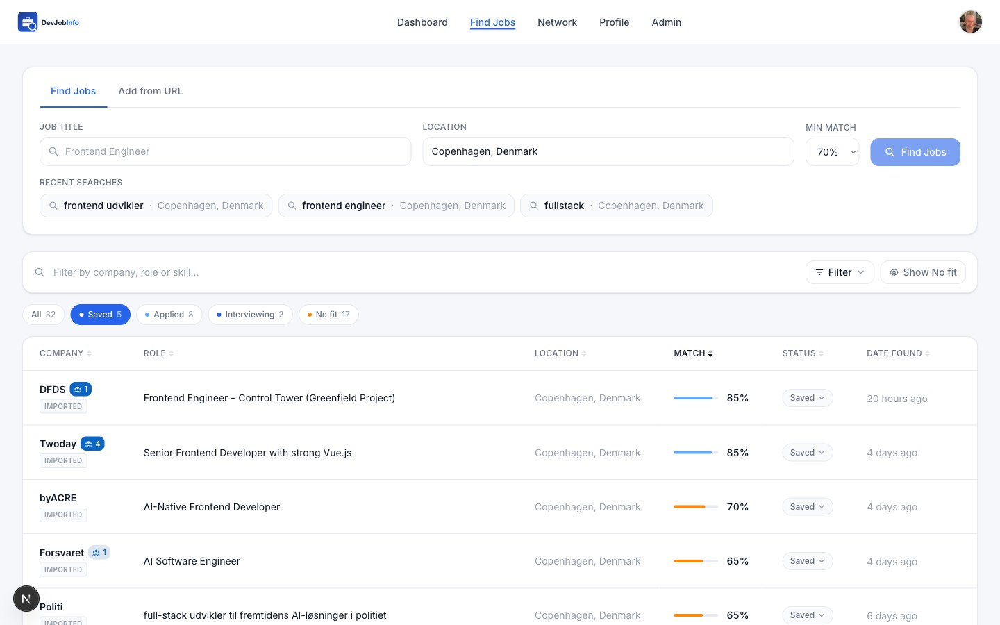

# DevJobInfo

An AI-powered job hunting assistant. Set up your profile once, then let the agent find relevant jobs, score them against your actual skills, research each company, generate a tailored cover letter, and tell you who in your network to reach out to — all before you click Apply.

**Live:** [devjob.info](https://devjob.info)

---


---

## What it does

### Find jobs that match your real skills

Search by title and location across Adzuna, JobTech, Jooble, CareerJet, and Glassdoor simultaneously. GPT-4o scores every job 0–100 against your profile and explains exactly which skills match and which are missing — so you spend time on roles worth applying to.



### Research any company in one click

Browserbase + Stagehand autonomously browses the company's public website and builds a structured dossier: business overview, tech stack, culture signals, why the role exists, and smart interview prep talking points. Falls back to GPT-4o synthesis if the site can't be reached.


### AI cover letter and tailored resume

One click generates a personalised cover letter using your profile, the job description, and the company research. The letter is always written in the detected language of the job posting (Danish, Swedish, Norwegian, German, Dutch, French, Spanish, English). Download as PDF or copy as plain text. Tailored resume PDFs are generated per role from the same source.

### Network intelligence

Import your LinkedIn connections once. DevJobInfo cross-references them against every job in your list so you always know when a warm intro is possible. For each job, the AI recommends the single best contact to reach out to and generates a ready-to-send, under-300-character LinkedIn message.


### Full application pipeline

Move jobs through Saved → Applied → Interviewing → Offer. Dashboard analytics (PostHog-powered) show jobs over time, match score distribution, and company research activity.

---

## Feature summary

| Feature | Details |
|---|---|
| Job discovery | Adzuna, JobTech, Jooble, CareerJet, Glassdoor searched in parallel |
| AI scoring | GPT-4o scores 0–100 with matched + missing skills per job |
| Company research | Browserbase live browsing → structured dossier with interview prep |
| Cover letter | GPT-4o, language-detected, PDF + plain text download |
| Tailored resume | Job-specific PDF generated per role |
| Resume extraction | Upload existing PDF — GPT-4o pre-fills your profile |
| Network intelligence | LinkedIn connection import, AI contact selection, message generation |
| Application tracking | Saved → Applied → Interviewing → Offer pipeline |
| Dashboard analytics | Charts for activity, scores, and research via PostHog |
| User approval gate | Admin-controlled sign-up approval with Resend email notifications |

---

## Stack

| Layer | Tool |
|---|---|
| Framework | Next.js 16 (App Router) |
| Backend (DB, Auth, Storage) | InsForge |
| AI model | OpenAI GPT-4o |
| Cloud browser | Browserbase |
| Browser automation | Stagehand |
| Job sources | Adzuna, JobTech, Jooble, CareerJet, RapidAPI (Glassdoor) |
| Analytics | PostHog |
| Email | Resend |
| PDF generation | @react-pdf/renderer |
| Styling | Tailwind CSS 4 |
| Language | TypeScript (strict) |

---

## Pages

```
/                  Homepage
/auth/login        Google + GitHub OAuth
/dashboard         Stats, activity feed, analytics
/find-jobs         Search + job list with filters
/find-jobs/[id]    Job details, company research, cover letter, tailored resume, network contacts
/network           LinkedIn connection import and management
/profile           Profile builder, resume upload and generation
/pending           Waiting-for-approval page (shown to unapproved users)
/admin             Admin panel — approve or reject pending users
```

---

## Prerequisites

- Node.js 20+
- An [InsForge](https://insforge.dev) project with Google and/or GitHub OAuth configured
- An [OpenAI](https://platform.openai.com) account with GPT-4o access
- A [Browserbase](https://browserbase.com) account for company research
- Job source API keys (Adzuna required; Jooble, CareerJet, RapidAPI optional but recommended)
- A [PostHog](https://posthog.com) project for analytics (optional)
- A [Resend](https://resend.com) account with a verified sender domain for approval emails

---

## Local setup

### 1. Install dependencies

```bash
npm install
```

### 2. Configure environment variables

Create `.env.local` in the project root:

```env
# InsForge — database, auth, and file storage
NEXT_PUBLIC_INSFORGE_URL=https://your-project.region.insforge.app
NEXT_PUBLIC_INSFORGE_ANON_KEY=your-anon-key

# OpenAI — job matching, cover letters, resume generation, research synthesis
OPENAI_API_KEY=sk-...

# Browserbase — headless browser for company research
BROWSERBASE_API_KEY=bb_live_...
BROWSERBASE_PROJECT_ID=your-project-id

# Job sources
ADZUNA_APP_ID=your-adzuna-app-id        # developer.adzuna.com
ADZUNA_APP_KEY=your-adzuna-app-key
JOOBLE_API_KEY=your-jooble-key          # jooble.org/api/index
CAREERJET_API_KEY=your-careerjet-key    # careerjet.com/affiliate
RAPIDAPI_KEY=your-rapidapi-key          # rapidapi.com — used for Glassdoor

# Resend — transactional emails for user approval flow
RESEND_API_KEY=re_...
RESEND_FROM_EMAIL=noreply@yourdomain.com   # must be a verified Resend sender domain
ADMIN_EMAIL=your@email.com                 # receives new sign-up notifications
NEXT_PUBLIC_APP_URL=https://your-app-url   # used in email links

# PostHog — event tracking and dashboard charts
NEXT_PUBLIC_POSTHOG_PROJECT_TOKEN=phc_...
NEXT_PUBLIC_POSTHOG_HOST=https://eu.i.posthog.com
POSTHOG_PERSONAL_API_KEY=phx_...
POSTHOG_API_HOST=https://eu.posthog.com
POSTHOG_PROJECT_ID=your-project-id
```

### 3. Run

```bash
npm run dev
```

Open [http://localhost:3000](http://localhost:3000).

---

## Environment variable reference

| Variable | Required | Description |
|---|---|---|
| `NEXT_PUBLIC_INSFORGE_URL` | Yes | InsForge backend base URL |
| `NEXT_PUBLIC_INSFORGE_ANON_KEY` | Yes | InsForge public anon key |
| `OPENAI_API_KEY` | Yes | OpenAI API key — needs GPT-4o access |
| `BROWSERBASE_API_KEY` | Yes | Browserbase API key for company research |
| `BROWSERBASE_PROJECT_ID` | Yes | Browserbase project ID |
| `ADZUNA_APP_ID` | Yes | Adzuna app ID |
| `ADZUNA_APP_KEY` | Yes | Adzuna app key |
| `RESEND_API_KEY` | Yes | Resend API key for approval emails |
| `RESEND_FROM_EMAIL` | Yes | Verified sender address (e.g. `noreply@yourdomain.com`) |
| `ADMIN_EMAIL` | Yes | Admin email — receives new sign-up notifications |
| `NEXT_PUBLIC_APP_URL` | Yes | Public app URL — used in email login links |
| `JOOBLE_API_KEY` | No | Jooble API key |
| `CAREERJET_API_KEY` | No | CareerJet API key |
| `RAPIDAPI_KEY` | No | RapidAPI key — used for Glassdoor integration |
| `NEXT_PUBLIC_POSTHOG_PROJECT_TOKEN` | No | PostHog project token for browser-side event capture |
| `NEXT_PUBLIC_POSTHOG_HOST` | No | PostHog ingest host (`https://eu.i.posthog.com` for EU) |
| `POSTHOG_PERSONAL_API_KEY` | No | PostHog personal API key — used for dashboard chart queries |
| `POSTHOG_API_HOST` | No | PostHog API host (`https://eu.posthog.com` for EU) |
| `POSTHOG_PROJECT_ID` | No | PostHog project ID |

---

## Project structure

```
/
├── agent/                      # AI agent logic — no React, no UI
│   ├── find-jobs.ts            # Multi-source job discovery + GPT-4o scoring
│   ├── research-company.ts     # Browserbase + Stagehand company dossier
│   ├── generate-cover-letter.ts
│   └── import-job-from-url.ts
├── app/
│   ├── page.tsx                # Landing page
│   ├── auth/                   # OAuth login + callback handler
│   ├── dashboard/              # Stats, activity feed, analytics charts
│   ├── find-jobs/              # Search form + job list + job details
│   ├── network/                # LinkedIn connection import and management
│   ├── profile/                # Profile builder + resume management
│   ├── pending/                # Pending approval page
│   ├── admin/                  # Admin panel (approve/reject users)
│   └── api/                    # API routes (agent triggers, resume, jobs, admin)
├── actions/                    # Next.js Server Actions (profile save/update)
├── components/                 # UI components — no DB calls, no business logic
│   ├── network/                # ContactSuggestion, NetworkTabs, ConnectionsTable
│   ├── find-jobs/              # JobsTable, JobDetail, CompanyDossierDisplay
│   ├── dashboard/              # OnboardingDialog, analytics charts
│   └── ...
├── lib/                        # Third-party client init + shared utilities
│   ├── resend.ts               # Email functions (pending, approved, admin notification)
│   └── utils.ts                # shortenLocation and other shared helpers
├── types/                      # Shared TypeScript types
└── context/                    # Architecture docs and AI agent guidelines
```

See [`context/app-map.md`](context/app-map.md) for a full reference of every route, component, agent, and utility function.

---

## Key flows

### Finding jobs
1. Fill in job title and location on the Find Jobs page
2. The agent searches all sources in parallel and GPT-4o scores each result against your profile
3. Jobs appear in the table sorted by match score with matched and missing skills
4. Click any row to open the full job detail page

### Company research
1. Open a job's detail page and click **Research Company**
2. The agent opens a Browserbase session, browses the company's public website (homepage, About, Engineering/Blog pages), and synthesises a structured dossier
3. Fallback: if the site can't be reached, GPT-4o generates a best-effort dossier from the company name and job description alone

### Cover letter
1. Click **Generate Cover Letter** on any job detail page
2. GPT-4o writes a letter using your profile, job description, and company research dossier
3. The letter is written in the detected language of the job posting
4. Download as PDF or copy as plain text; previous versions are archived automatically

### Resume
1. Upload an existing PDF on the Profile page — GPT-4o extracts your details and pre-fills the form
2. Edit any field manually, then generate a clean PDF resume from your current profile
3. From any job detail page, generate a job-tailored version optimised for that role

### Network intelligence
1. Go to the Network page and import your LinkedIn connections CSV (exported from LinkedIn Settings → Data Privacy)
2. DevJobInfo parses and stores all connections, indexed by company
3. On any job detail page, the **Contacts to reach out to** section shows which connections work at that company
4. The AI selects the best contact (recruiter, hiring manager, or relevant colleague) and explains why
5. Click **Generate message** to get a personalised, under-300-character LinkedIn outreach message

### User approval
1. New user signs in via Google or GitHub OAuth
2. They land on `/pending` and receive an email telling them their account is under review
3. The admin receives a notification email and reviews the request at `/admin`
4. Admin clicks **Approve** — the user gets an email with a login link and can now access the app
5. Unapproved users are blocked from all protected routes by `proxy.ts` via the `jp_approved` cookie

---

## Admin setup

To grant admin access to a user, run the following SQL on your InsForge database:

```sql
UPDATE profiles
SET approval_status = 'approved', is_admin = true
WHERE id = (SELECT id FROM auth.users WHERE email = 'your@email.com' LIMIT 1);
```

Admins see an **Admin** link in the navbar and can access `/admin` to approve or reject pending users.

---

## Deployment

Deploys automatically to InsForge on every push to `main` via GitHub Actions.

The workflow requires one repository secret:

| Secret | Description |
|---|---|
| `INSFORGE_REFRESH_TOKEN` | InsForge CLI refresh token for CI authentication |

To deploy manually:

```bash
npx @insforge/cli@latest deployments deploy .
```

Remember to set all required environment variables in your InsForge deployment settings — `.env.local` is only used for local development.

---

## Notes

- **Browserbase** is required for company research. Without it the agent falls back to GPT-4o synthesis only (no live browsing).
- **Agent routes** (`/api/agent/*`) can run for up to 5 minutes. On short-timeout serverless platforms, max execution time may need to be increased.
- **Job language detection** covers Danish, Swedish, Norwegian, German, Dutch, French, Spanish, and English. Letters are always written in the detected language of the job posting.
- **LinkedIn CSV import** — export from LinkedIn → Settings → Data Privacy → Get a copy of your data → Connections. The CSV is parsed client-side; raw files are not stored.
- **Adzuna** always searches with `category=it-jobs`. Change this in `lib/adzuna.ts` for non-tech roles.
- **RLS** — all database queries are scoped to the authenticated user via InsForge Row Level Security. Never query without a `user_id` filter in application code.
- **Approval cookie lifetime** — `jp_approved` is a 7-day httpOnly cookie. If an admin revokes a user's approval, they retain access until the cookie expires or they log out.
- **Resend sender domain** — `RESEND_FROM_EMAIL` must be a verified domain in your Resend dashboard. Approval emails will silently fail until this is configured.
